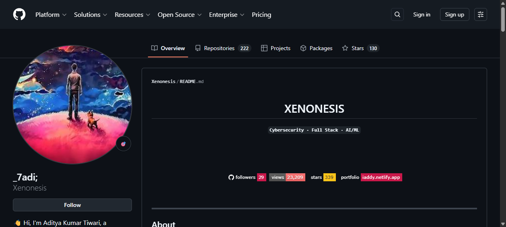
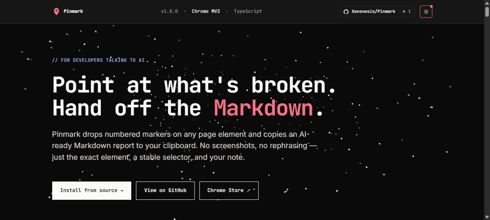

# pi-powerkit

> A curated collection of powerful extensions and provider configurations for [pi-coding-agent](https://pi.dev/).

[](https://github.com/Xenonesis/Pi-Powerkit)
[](./LICENSE)
[](https://pi.dev/)

## See it in action

### LLM-driven browser — describe what you want, AI does it



### Real website analysis — find issues automatically



## What's included

| Package | Description | Install |
|---------|-------------|---------|
| **[pi-agent-browser](./packages/pi-agent-browser)** | LLM-driven browser automation via `agent-browser` CLI. Visual feedback with vision-capable models. | `pi install git:github.com/Xenonesis/Pi-Powerkit/tree/main/packages/pi-agent-browser` |
| **[pi-cline-free](./packages/pi-cline-free)** | 11 verified-working Cline free models + 1 TokenRouter model. | `pi install git:github.com/Xenonesis/Pi-Powerkit/tree/main/packages/pi-cline-free` |
| **[pi-opencode-free](./packages/pi-opencode-free)** | Dynamic OpenCode Zen free model fetcher with cached lookup. | `pi install git:github.com/Xenonesis/Pi-Powerkit/tree/main/packages/pi-opencode-free` |
| **[pi-headroom](./packages/pi-headroom)** | Context compression via Headroom (60–95% token savings). *Optional — uses extra RAM.* | `pi install git:github.com/Xenonesis/Pi-Powerkit/tree/main/packages/pi-headroom` |
| **[pi-agentrouter](./packages/pi-agentrouter)** | AgentRouter provider with 5 premium models (GPT-5.5, Claude Opus 4.6/7/8, GLM-5.2). | `pi install git:github.com/Xenonesis/Pi-Powerkit/tree/main/packages/pi-agentrouter` |
| **[pi-kilocode](./packages/pi-kilocode)** | 10 KiloCode free models for pi — auto-verified. | `pi install git:github.com/Xenonesis/Pi-Powerkit/tree/main/packages/pi-kilocode` |
| **[pi-aihubmix](./packages/pi-aihubmix)** | 25 free coding models via AIHubMix (GLM, Kimi, Gemini, GPT-OSS, Nemotron, MiMo, Gemma, Qwen + more). | `pi install git:github.com/Xenonesis/Pi-Powerkit/tree/main/packages/pi-aihubmix` |
| **[pi-router9](./packages/pi-router9)** | Router9 provider — MiniMax M3 model with 1M context. | `pi install git:github.com/Xenonesis/Pi-Powerkit/tree/main/packages/pi-router9` |
| **[pi-xiaomi](./packages/pi-xiaomi)** | Xiaomi MiMo provider — mimo-v2.5 & mimo-v2.5-pro (1M context). | `pi install git:github.com/Xenonesis/Pi-Powerkit/tree/main/packages/pi-xiaomi` |
| **[pi-databricks](./packages/pi-databricks)** | Databricks provider — system.ai.glm-5-2 model. | `pi install git:github.com/Xenonesis/Pi-Powerkit/tree/main/packages/pi-databricks` |
| **[pi-modal](./packages/pi-modal)** | Modal provider — GLM-5-FP8 & GLM-5.1-FP8 models. | `pi install git:github.com/Xenonesis/Pi-Powerkit/tree/main/packages/pi-modal` |
| **[pi-ddg-search](./packages/pi-ddg-search)** | Free web search via DuckDuckGo — no API key required. | `pi install git:github.com/Xenonesis/Pi-Powerkit/tree/main/packages/pi-ddg-search` |
| **[pi-ssh](./packages/pi-ssh)** | SSH remote execution — run read/write/edit/bash on remote machines. | `pi install git:github.com/Xenonesis/Pi-Powerkit/tree/main/packages/pi-ssh` |

## Install everything (alternative)

If you already have pi and just want the packages without the full bootstrap:

```bash
pi install git:github.com/Xenonesis/Pi-Powerkit
```

This installs all 13 packages. You still need to set API keys via `.env` or `models.json`.

> **Note:** pi-headroom is optional — it runs a local compression service that uses extra RAM. Skip if you're on a tight system.

## OS Compatibility

| OS | Status | Notes |
|-----|--------|-------|
| **Linux** | ✅ Full | Tested on Ubuntu/Debian/Kali. All tools auto-configure. |
| **macOS** | ✅ Full | Paths detected automatically for Zed and VS Code. |
| **Windows** | ⚠️ WSL/Git Bash | Needs WSL or Git Bash for bash scripts. Pi + OMP work natively. |

**Requirements:** bash, python3, npm, git. All common on dev machines.

## Features

- 🌐 **Web search** — free DuckDuckGo search, no API key
- 🤖 **LLM-driven browser** — your AI can browse the web, take screenshots, click buttons, fill forms
- 🆓 **50+ free models** — across AIHubMix (25), Cline (11), OpenCode Zen (6), KiloCode (10), TokenRouter
- 👁️ **Visual feedback** — vision-capable models can see and describe screenshots
- ⚡ **Cached & dynamic** — instant startup, auto-refreshes free model lists
- 🔒 **Self-hosted** — everything runs locally, your data stays with you
- 🔌 **SSH remote** — run on remote machines via SSH
- 🔌 **Modular** — install only what you need
- 🗜️ **Context compression** — headroom integration for 60–95% token savings

## Quick start — Clone & run

```bash
git clone https://github.com/Xenonesis/Pi-Powerkit.git
cd Pi-Powerkit

# Copy .env and fill in your API keys (or run setup for interactive prompts)
cp bootstrap/.env.example .env
nano .env

# One-command setup: creates configs, installs deps, sets up browser
bash setup.sh

# Restart pi, then /model to see all providers
```

> **No API keys?** OpenCode Zen (6 free models) and some aihubmix models work without keys. Just run `setup.sh` and press Enter to skip each key.
# 2. Set API keys (free tiers available everywhere)
export CLINE_API_KEY="sk_..."
export OPENCODE_API_KEY="sk-..."
export TOKENROUTER_API_KEY="sk-..."
export NVIDIA_NIM_API_KEY="nvapi-..."   # optional
export AIHUBMIX_API_KEY="sk-..."
export ROUTER9_API_KEY="sk-..."
export XIAOMI_API_KEY="sk-..."
export DATABRICKS_API_KEY="dapi..."
export MODAL_API_KEY="sk-..."

# Headroom (optional, for context compression — uses extra RAM)
export HEADROOM_API_URL="http://127.0.0.1:8787"
export HEADROOM_API_KEY="sk-..."

# 3. Install packages
pi install git:github.com/Xenonesis/Pi-Powerkit

# 4. Restart pi, then /model to see new providers
```

## Use cases

### 1. Browse and analyze websites
```
> Open https://github.com/Xenonesis and tell me about the projects
> Visit https://xenonesis.github.io/Pinmark and list all the UX issues you find
```

### 2. Access free coding models
```
/model
# See 11+ Cline models, OpenCode free models, TokenRouter, etc.
```

### 3. Visual testing
```
> Open my app at localhost:3000 and take a screenshot. Does the layout look correct?
```

## How it works

### pi-agent-browser
Wraps the [`agent-browser`](https://www.npmjs.com/package/agent-browser) CLI and exposes it as the `browser` tool in pi. The LLM can autonomously chain commands:
```
browser("open https://...")     # navigate
browser("snapshot -i")          # get interactive elements with refs
browser("click @e5")            # click an element
browser("get text")             # extract page text
browser("screenshot")           # visual feedback (vision models)
```

### pi-cline-free
Registers 11 verified-working Cline free models + 1 TokenRouter model. API keys read from environment variables (`CLINE_API_KEY`, `TOKENROUTER_API_KEY`).

### pi-opencode-free
Fetches free models from OpenCode Zen API at startup, caches them to `~/.pi/agent/cache/opencode-free.json`, refreshes in background every hour. API key from `OPENCODE_API_KEY`.

### pi-headroom
Wraps the [Headroom](https://github.com/headroomlabs-ai/headroom) compression service. Provides two tools:
- `headroom.compress` — compress text/messages to save tokens
- `headroom.status` — check if the Headroom server is reachable

Configure with:
```bash
export HEADROOM_API_URL="http://127.0.0.1:8787"   # default proxy
export HEADROOM_API_KEY="sk-..."                     # optional for cloud

## QuickJS Compatibility (pi_agent_rust)

| Package | Works with pi_agent_rust (QuickJS)? | Notes |
|---------|:---:|-------|
| pi-agent-browser | ❌ | Uses \`node:child_process\` (spawn) — needs native Node |
| pi-cline-free | ✅ | Env var + registerProvider — pure JS, no Node deps |
| pi-opencode-free | ❌ | Uses \`node:fs\`, \`node:path\`, \`node:os\` for cache |
| pi-headroom | ✅ | Env var + fetch — pure JS (if avoid node:fs) |
| pi-agentrouter | ✅ | Env var + registerProvider — pure JS |
| pi-kilocode | ✅ | Env var + registerProvider — pure JS |
| pi-aihubmix | ✅ | Env var + registerProvider — pure JS |
| pi-router9 | ✅ | Env var + registerProvider — pure JS |
| pi-xiaomi | ✅ | Env var + registerProvider — pure JS |
| pi-databricks | ✅ | Env var + registerProvider — pure JS |
| pi-modal | ✅ | Env var + registerProvider — pure JS |
| pi-ddg-search | ❌ | Uses \`node:child_process\` (curl) — needs native Node |
| pi-ssh | ❌ | Uses \`node:child_process\` (spawn) — needs native Node |

> Most provider extensions work with pi_agent_rust because they only use \`registerProvider()\` and env vars. Browser, cache-based, search, and SSH extensions need Node.js.

## Setup details

See individual package READMEs:
- [pi-agent-browser setup](./packages/pi-agent-browser/README.md)
- [pi-cline-free setup](./packages/pi-cline-free/README.md)
- [pi-opencode-free setup](./packages/pi-opencode-free/README.md)
- [NVIDIA NIM setup](./examples/README.md)
- [pi-headroom setup](./packages/pi-headroom/README.md)

## Contributing

Issues and PRs welcome! Each package is independent — feel free to improve one without touching others.

## License

MIT — see [LICENSE](./LICENSE)